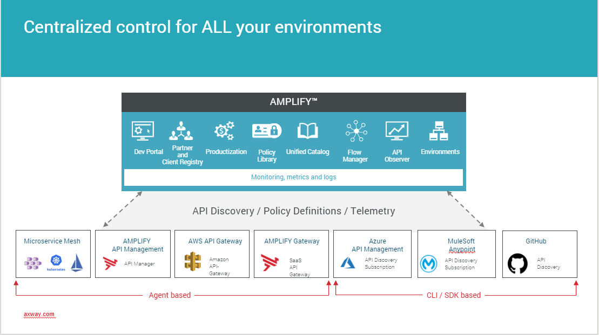

### Unified Catalog integrations
This repo provides a set of assets that can help you automate the discovery of all integration assets and APIs, from across multiple environments, such as Azure, and publish them in a centralized catalog to drive consumption and reuse of your existing APIs. These environments can also be repositories such as GitHub, SwaggerHub.

AMPLIFY Unified Catalog  provides event-driven subscription management capabilities, that can enable you to create custom subscription flows for each registered environment, enabling complex approval flows and integration with existing systems to streamline experience and reduce time for approval. The full capabilities of the Unified Catalog are available through CLI to automate the discovery and management of your APIs in the Catalog. 

You can benefit from this: 
* if you have APIs that are spread across multiple gateways from multiple vendors, such as Azure or Mulesoft
* lack visibility into all your integrations assets and need to have a holistic view of all your APIs
* need to implement a multi-step approval process and integrate with third party systems such as Microsoft Teams. 

### Integration with Azure API Management

Check out our [readme](./azure/README.md) to learn how to publish APIs from Azure API Management to Unified Catalog, and build a custom subscription flow to delegate the approval of subscription requests to Microsoft Teams. 

### Integration with Mulesoft Anypoint Exchange
Check out our [readme](./mulesoft/README.md) to learn how to publish APIs from Mulesoft to Unified Catalog, and build a custom subscription flow to delegate the aprroval of suscription requests to Microsoft Teams. 

### Integration with Bitbucket
Read our [readme](https://github.com/Axway/unified-catalog-integrations/blob/master/bitbucket/bitbucket-extension/README.md) to learn how to fetch APIs from Bitbucket and publish them to the Unified Catalog.

### Integration with Github
Read our [readme](./github/github-extension/Readme.md) to learn how to fetch APIs from Github and publish them to the Unified Catalog.  

### Integration with SwaggerHub
Check our [readme](./swaggerhub/swaggerhub-extension/README.md) to learn how to fetch your API definitions from SwaggerHub and publish them to the Unified Catalog. 

### Integration with Apigee
Check our [readme](./apigee/apigee-extension/README.md) to learn how to fetch your API definitions from Apigee and publish them to the Unified Catalog. 

### Integration with Axway API Manager
Check our [readme](./axway-api-manager/README.md) to learn how set up a Subscription Approval flow for Axway API Manager.
