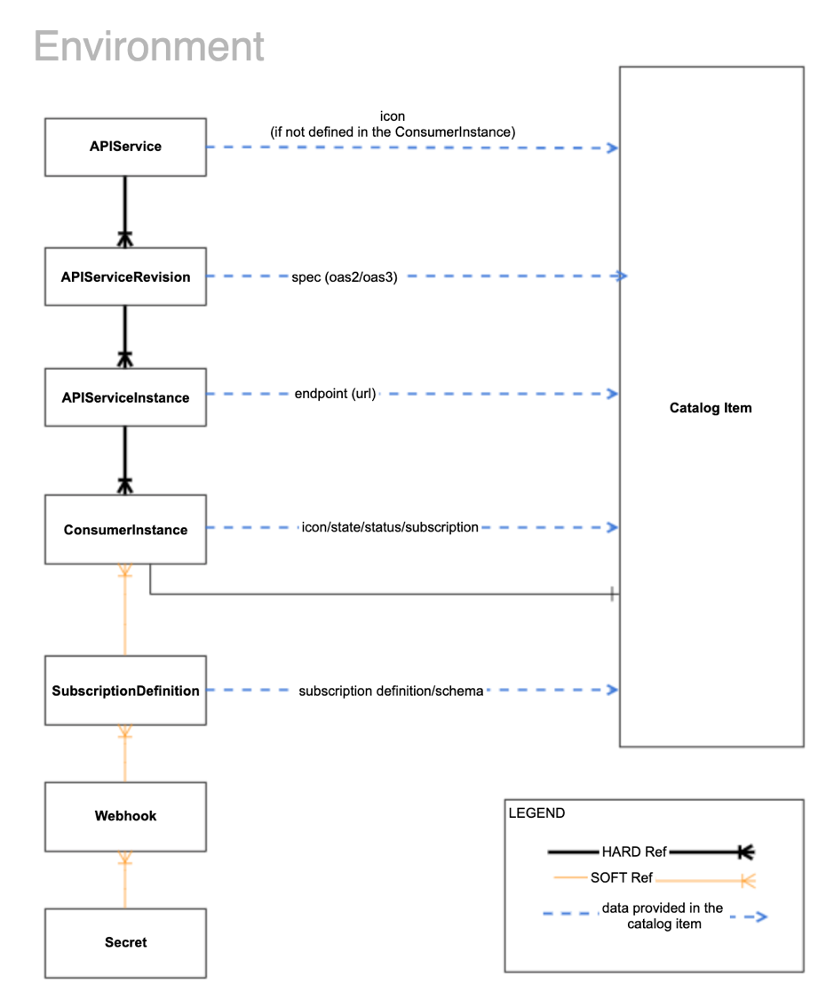
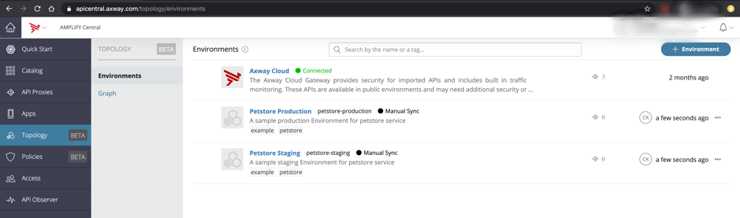
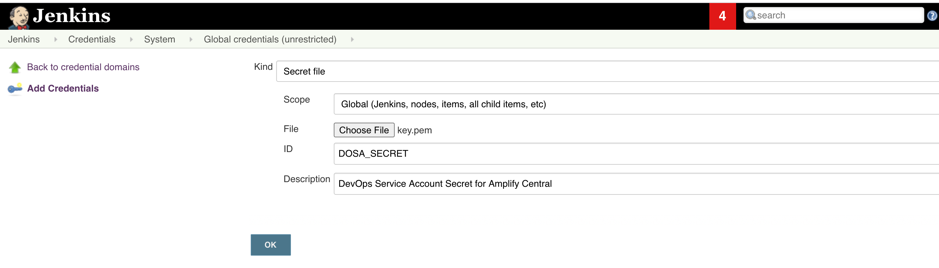
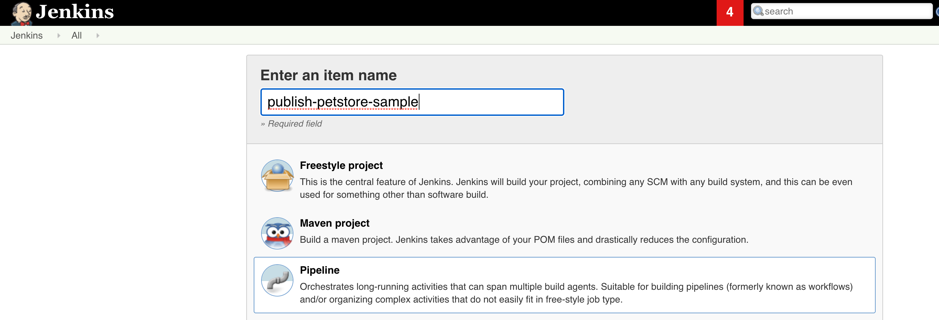

In this project we explain one of the ways on how you can publish your resources or artifacts to AMPLIFY Catalog using the pipelines and help your organization team members or consumers to discover the resources. 

Here we have two pipeline triggers used,
* Merging code to your main branch
  - In the case where the code is merged to main branch, there will be a pipeline trigger to create the resources on the staging environment with latest documentation and specification. This will also create the Catalog Item in AMPLIFY Catalog with restricted visibility just for the owning team. 
* Release of the service. 
  - The release (or tagging ) of the service will trigger a new pipeline to create and push resources to the production environment with the catalog Item of public visibility so the consumers can discover the asset in AMPLIFY Catalog in the central organization.

This sample petstore project uses the following resources 

1. Environment : It is a logical grouping of API Services. Eg: Production ,Staging environment to create resources under it. (Created )
2. APIService  : Represents the model of your service in AMPLIFY Central. 
3. APIServiceRevision : An object for representing the specification of your service across the different versions. The input specification could be of type oas3, oas2, wsdl, protobuf etc.
4. APIServiceInstance : It is a deployed instance of your service. It provides the protocol, host, port, basePath for where the service is deployed.
5. ConsumerInstance: It describes the catalog item configuration details (owning team, visibility, state, status, tags, icon, documentation...).


We also download the specification file of petstore and add it in APIServiceRevision. Specification URl used is https://petstore.swagger.io/v2/swagger.json

### Prerequisites
* Local machine setup needs:
    - docker (optional: Needed if you want to build the docker image with all tools and script)
    - Node.js
    - Axway cli
* AMPLIFY Central Provisioned Organization
* DOSA Service Account in AMPLIFY Central
* AMPLIFY Central Environment
* Github Account or Gitlab Account


### Configure the DOSA (Service Account) on AMPLIFY central
* Follow the below procedure to create DOSA (Service Account) step by generating the key pair.
https://docs.axway.com/bundle/axway-open-docs/page/docs/central/cli_central/cli_install/index.html

* Create a new service account with generated public key. Make a note of the client-id, it will be used as an environment variable in the pipeline.

### Create an Environment in AMPLIFY central

Environments can be created with Axway central cli. Refer: https://docs.axway.com/bundle/axway-open-docs/page/docs/central/cli_environments/index.html

UI:
* Login to Axway central and navigate from Topology to Environments option.
* Create a new environment. Make a note of the environment name as it will be used as env variable in pipelines.


For this tutorial we have created two environments as shown in the above screenshot.

### Docker Image 
In the workflow script we have used the node:stretch-slim base docker image with added tools like gettext-base,jq,curl and gnupg. 
The docker image axway.jfrog.io/ampc-public-docker-release/node-axway-cli used here is in public docker registry and can be used.
You can use any node base image to build your custom image and add the below line to install few tools
```bash
RUN apt-get update
RUN apt-get install -y gettext-base jq curl gnupg
RUN npm install -g @axway/axway-cli
```
## GITHUB

### Setup the github repository with actions:

1. Download the pipeline folder files into your own github repository for which you want to publish in AMPLIFY Catalog.
    In order to create a new github repository, please use this link https://help.github.com/en/github/creating-cloning-and-archiving-repositories/creating-a-new-repository

2. Encrypt the private key generated for the DOSA service account using the gpg. 
Refer: https://help.github.com/en/actions/configuring-and-managing-workflows/creating-and-storing-encrypted-secrets#limits-for-secrets
```bash
gpg --symmetric --cipher-algo AES256 private_key.pem
```
3. Add the large secret passphrase and store the value in your github repository secrets as listed below.
* From your GitHub repository, select the Settings tab.

* Select Secrets from the left menu.

* Enter the following values:
```bash
Name: LARGE_SECRET_PASSPHRASE
Value: (Paste the secret passphrase used for encrypting the key)
```
Select Add secret.


4. Copy the resources directory into your github repository at root level. 
5. Copy the workflows directory to your github repository folder .github. This .github folder will be used for the workflow actions. To create a new workflow, you can use the below procedure

* From your GitHub project, select Actions on the top menu and click on the new workflow to setup yourself.

* Change the workflow name to notify the specific action rather than main.yml. For example: petstore-ci-production.yml.

* Replace the content of the yml file with the following values:
```yaml
# This is a basic workflow to help you get started with Actions to publish in AMPLIFY Catalog

name: Staging-Publish-To-Amplify-Catalog

# Controls when the action will run. Triggers the workflow on push or pull request
# events but only for the master branch
on:
  push:
    branches: 
      - master
# A workflow run is made up of one or more jobs that can run sequentially or in parallel
jobs:
  # This workflow contains a single job called "publish-petstore" with multiple steps
  publish-petstore:
    # The type of runner that the job will run on
    runs-on: ubuntu-latest
    container:
      image: axway.jfrog.io/ampc-public-docker-release/node-axway-cli
    # Steps represent a sequence of tasks that will be executed as part of the job
    steps:
    # Runs a set of commands using the runners shell
    # Check out the project files.
    - uses: actions/checkout@v2
    # update the AMPLIFY central cli to specific version eg: Change CLI_VERSION variable to point 0.1.3-dev.10
    - name: update-cli
      run: |
            axway pm install @axway/axway-central-cli@$CLI_VERSION
            gpg --quiet --batch --yes --decrypt --passphrase=${{ secrets.LARGE_SECRET_PASSPHRASE }} --output $HOME/key.pem private_key.pem.gpg
            axway config set auth.tokenStoreType file
    # this step will use the shell script with the below env variables to create the resources in AMPLIFY central
    - name: petstore-publish
      run: |
            ./create.sh -did=$DOSA_CLIENT_ID -pk=$HOME/key.pem -cet=$CENTRAL_ENV_TYPE -cen=$CENTRAL_ENV_NAME -rp=$RESOURCES_PATH
    env:
      # AMPLIFY central cli version to be used.
      CLI_VERSION: 1.5.0
      # User Resource file paths to create in AMPLIFY central using the cli.
      RESOURCES_PATH: resources/petstore-sample
      # User Documentation to be added in the catalog item. 
      CATALOG_DOCUMENTATION_FILE_NAME: catalogDocumentation.md
      # User Image of the catalog Item to be published.
      IMAGE_LOCATION_FILE_NAME: image.png
      # User specified environment type for which catalog item will be published.
      CENTRAL_ENV_TYPE: staging
      # User version of the specification to be published in central.
      VERSION: alpha
      # User Service host where apis are hosted/deployed.
      SERVICE_HOST: petstore.swagger.io
      # User Service basepath to be called with apis.
      SERVICE_HOST_BASEPATH: /v2
      # Central Environment name used for creation of these resources.
      CENTRAL_ENV_NAME: petstore-staging
      # Central DOSA Service account client Id. 
      DOSA_CLIENT_ID: DOSA_CLIENT_ID_VALUE
      # User service specification url for fetching the swagger/oas3 etc. Used in the script
      SPECIFICATION_URL: https://petstore.swagger.io/v2/swagger.json
      # Central catalog Item state to be PUBLISHED or UNPUBLISHED.
      CATALOG_ITEM_STATE: PUBLISHED
      # Central catalog Item visibility for restriction to specific teams in central or public to organization.
      CATALOG_ITEM_VISIBILITY: RESTRICTED
      # Central owning team of the catalog Item published.
      OWNING_TEAM_NAME: "Default Team"
```
## GITLAB

###  Setup gitlab repository:

1. Download the pipeline folder files into your own gitlab repository for which you want to publish in AMPLIFY Catalog.
    In order to create a new gitlab repository, please use this link https://docs.gitlab.com/ee/gitlab-basics/create-project.html
2. Add the DOSA secret key (DOSA_SECRET) in the gitlab variables as a file type. Eg: $DOSA_SECRET Refer the process here https://docs.gitlab.com/ee/ci/variables/README.html#create-a-custom-variable-in-the-ui
3. Copy the resources directory under cicd into your gitlab repository at root level. 
4. Create a .gitlab-ci.yml file in the root directory. Setup the runner for your project. You can follow this link https://docs.gitlab.com/ee/ci/runners/ for setup.
5. Modify the details of each resource files in the resources folder depending on the project details if needed.
6. Add the gitlabci stage 'publish' and copy the below stage eg:
```yaml

stages:
  - publish

publish_amplify_catalog_staging:
  stage: publish
  image: axway.jfrog.io/ampc-public-docker-release/node-axway-cli
  variables:
      CLI_VERSION: 1.5.0
      RESOURCES_PATH: resources/petstore-sample
      CATALOG_DOCUMENTATION_FILE_NAME: catalogDocumentation.md
      IMAGE_LOCATION_FILE_NAME: image.png
      CENTRAL_ENV_TYPE: staging
      VERSION: alpha
      SERVICE_HOST: petstore.swagger.io
      SERVICE_HOST_BASEPATH: /v2
      CENTRAL_ENV_NAME: petstore-staging
      DOSA_CLIENT_ID: DOSA_CLIENT_ID_VALUE
      SPECIFICATION_URL: https://petstore.swagger.io/v2/swagger.json
      CATALOG_ITEM_STATE: PUBLISHED
      CATALOG_ITEM_VISIBILITY: RESTRICTED
      OWNING_TEAM_NAME: "Default Team"
  before_script:
     - axway pm install @axway/axway-central-cli@$CLI_VERSION
     - axway config set auth.tokenStoreType file
  script:
     - ./create.sh -did=$DOSA_CLIENT_ID -pk="$DOSA_SECRET" -cet=$CENTRAL_ENV_TYPE -cen=$CENTRAL_ENV_NAME -rp=$RESOURCES_PATH
  only:
     - master
```
 Note: The above pipeline runs for master branch push and publishes the catalog Item with restricted access to Default Team in the organization of staging environment. 

7. The above job could also be used to publish for production environment in AMPLIFY Central when the service gets released or deployed. 
The below changes could be added in .gitlabci.yml for release of the service.
```yaml

stages:
  - publish

publish_amplify_catalog_production:
  stage: publish
  image: axway.jfrog.io/ampc-public-docker-release/node-axway-cli
  variables:
      CLI_VERSION: 1.5.0
      RESOURCES_PATH: resources/petstore-sample
      CATALOG_DOCUMENTATION_FILE_NAME: catalogDocumentation.md
      IMAGE_LOCATION_FILE_NAME: image.png
      CENTRAL_ENV_TYPE: production
      VERSION: alpha
      SERVICE_HOST: petstore.swagger.io
      SERVICE_HOST_BASEPATH: /v2
      CENTRAL_ENV_NAME: petstore-production
      DOSA_CLIENT_ID: DOSA_CLIENT_ID_VALUE
      SPECIFICATION_URL: https://petstore.swagger.io/v2/swagger.json
      CATALOG_ITEM_STATE: PUBLISHED
      CATALOG_ITEM_VISIBILITY: PUBLIC
      OWNING_TEAM_NAME: "Default Team"
  before_script:
     - axway pm install @axway/axway-central-cli@$CLI_VERSION
     - axway config set auth.tokenStoreType file
  script:
     - ./create.sh -did=$DOSA_CLIENT_ID -pk="$DOSA_SECRET" -cet=$CENTRAL_ENV_TYPE -cen=$CENTRAL_ENV_NAME -rp=$RESOURCES_PATH
  only:
     - tags
```

### Jenkins
Setup a jenkins job for publishing to central. 
 
Note: Jenkins should be able to run docker. If docker is not used, then you can install the below prerequisite tools(node, axway-cli, jq, curl, bash, envsubst) in jenkins machine. 

1. Copy the contents of cicd folder into your github/gitlab root directory.
2. Add a secret file type credential with the ID DOSA_SECRET eg:

3. Create a new job type of pipeline.

4. Select the pipeline from SCM for configuring the job and give the path to Jenkinsfile from your gitlab repo. Also you can configure for SCM change options to trigger the job.
5. Make sure the environment variables are set as needed in order to execute the job.

### Environment variables 
The env variables used for the resource templates used are below:

| Name                      |      Description                                                                                      |
|---------------------------|-------------------------------------------------------------------------------------------------------|
| CENTRAL_ENV_NAME          | The name of the Environment where to create the service resources                                     |
| CENTRAL_ENV_TYPE          | The environment type where the instance is deployed (production/staging)                              |
| VERSION                   | The version of the service to be published.                                                           |
| SERVICE_HOST              | The Host where the service is deployed .                                                              |
| SERVICE_HOST_BASEPATH     | The host basepath of the deployed service.                                                            |
| SERVICE_IMAGE             | The Base64 encoded value of a png image for the Service and Catalog Item .                            |
| OWNING_TEAM_NAME          | The owning team of the catalog Item to be published and restricted for.                               |
| CATALOG_DOCUMENTATION     | The markdown documentation of the catalog item .                                                      |
| CATALOG_ITEM_VISIBILITY   | The catalog Item visibility for restriction to specific teams in central or public to organization.   |
| CATALOG_ITEM_STATE        | The State to publish the catalog item to AMPLIFY Catalog or not.                                      |
| SPECIFICATION_BASE64      | The swagger/oas3 etc base64 encoded specification to be added in Catalog Item.           |

### Create script

#### Prerequisites
Following tools are needed to run the script:
- jq
- envsubst
- curl
- gnupg
- Axway cli

#### Description
The script will create/update all the resources from the resources folder.

Command line parameters for the `create.sh` script:


| Name                      | Default value                 |  Description                                                                          |
|---------------------------|-------------------------------|---------------------------------------------------------------------------------------|
| -a or --auth-type         | DOSA or web                   | The type if authentication used by the CLI                                            |
| -pk or --primary-key      | ./private_key.pem             | The location of the pem encoded private key if DOSA is used                           |
| -did or --dosa-id         | NO_DEFAULT_VALUE              | DOSA cline id if DOSA used for auth                                                   |
| -cen or --central-env-name| petstore-sample               | The Environment resource name where AMPLIFY Catalog resources will be created         |
| -cet or --central-env-type| production                    | The name of the environment type. Used in the APISeriviceInstance and ConsumerInstance|
| -rp or --resources-path   | resources/petstore-sample| The resources folder path for creating resources in AMPLIFY central                   |


Example:
```bash
./create.sh -did=DOSA_47d2201a33054173aa7e3449597e5d84 -pk=private_key.pem -rp=resources/petstore-sample -cet=production -cen=petstore
```
