### Layer7 Setup

**Introductions:**

This document will highlight how to create a client id and secret for accessing a Layer 7 API Portal’s admin portal as well as a tenanted portal which will allow the amplify client application access to the Portals API.  Once the client has access to an access token, the token can then be used to gain meta data surrounding each API on the portal.

**Supported Version of the Layer 7 API Portal:**

- Layer 7 API Portal 4.*
- Layer 7 API Gateway 9.2 +

**Important information for you to know when dealing with the Layer 7 API Portal:**

There are 2 areas that you need to worry about when accessing a customer’s API Portal:

1. Portal administration
    1. Admin portion of the layer 7 api portal
    2. Portal API (PAPI) – API’s we’ll be using to gain meta data surrounding the applications and apis being exposed on the portal.
2. Tenant
    1. Tenant provisioned for the customers gateway for a particular environment.  
    2. For example – Layer 7 API Gateway cluster in the customers DC1 and possibly a second DC2.
    3. In the above case you would see a DC1 tenant and a DC2 tenant.


**Below is an architecture diagram of the portal**

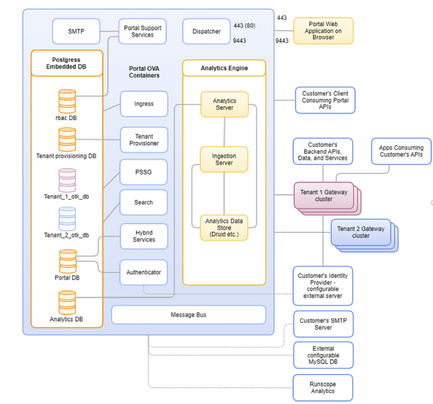

****

## API Portal Servies

The API Portal solution includes the following Docker services:

**Authenticator**: Authenticator performs native user authentication and allows integration with customer’s Identity Provider.

**Portal Services**: A set of microservices that provide Portal functionalities such as portal-data, Search, RBAC, and Theming.

**Ingress**: The central location for the Portal API, Metrics API, and Authorization API. Access Ingress and its APIs from the tenant Gateway or programmatically from your client systems. It is also the entry point to metrics and messaging using MQTT/s.

**PSSG**: PSSG, or Portal Gateway, is a PSSG component that provides services to enroll tenant gateways with API Portal, publishes and deploys APIs from API Portal to tenant Gateways, and manages mutual trust between tenant Gateways and API Portal.

**Dispatcher**: A public-facing service that proxies traffic to the API Portal web application. Port 80 is exposed but automatically redirects to https (443) traffic.

**Tenant Provisioner**: Used to provision tenant entities and resources.

**Message Bus**: Component for messaging support and inter-component communication.

## Port specifications

API Portal does not communicate directly to your tenant Gateways. For security, the communication is initiated from your tenant Gateway to the API Portal Depending on your use case and deployment model, you might need to allow traffic on your firewall between your tenant Gateway and API Portal. You must open an outbound connection to this port because traffic multiplexes into port 9443.

## Internal Supporting Services

API Portal provides and installs the following internal services:

**Analytics Engine**: The Ingress Gateway authenticates and forwards the request containing analytics data to Ingestion Server, which then streams it to the Kafka topic. The Druid cluster ingests this data from the Kafka topic and stores in MinIO system. The Analytics Service exposes capabilities to query analytics data stored in Druid system for reporting and visualization.


**SMTP Email Server**: A mail server is required for sending notification emails from the API Portal. A SMTP email server is provided with the installation. You can also configure and use your corporate email server. 

## External Supporting Services

You need the following items to support API Portal. They are located in their own environments outside the API Portal environment. Customers must provide these items.

**Tenant Gateway**: The tenant Gateway is a Layer7 API Gateway. It serves as an API proxy for the customer's backend APIs, services, and data. Customers also add policies to the tenant Gateway to provide authentication and other features to their APIs.

## Portal API

The Portal API has a swagger document for your consumption and this is what Axway Amplify uses for gaining necessary meta data points for each API and Applications.

[Portal API Swagger](https://techdocs.broadcom.com/us/en/ca-enterprise-software/layer7-api-management/api-developer-portal/4-5/publish/portal-api-papi/papi-swagger-file-4-5.html)

## Client Application Creation

1. Access to the Layer 7 API Portal (administration portal).  You will need an account to access the portal from the customer.
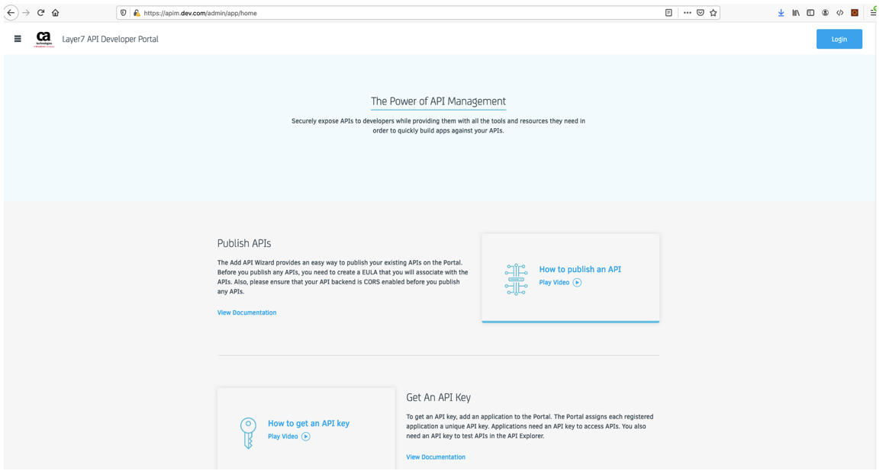

2. Login to the portal

3. Select Publish at the home page


4. Brings you to a list of APIs for the API Portal. Click Apps

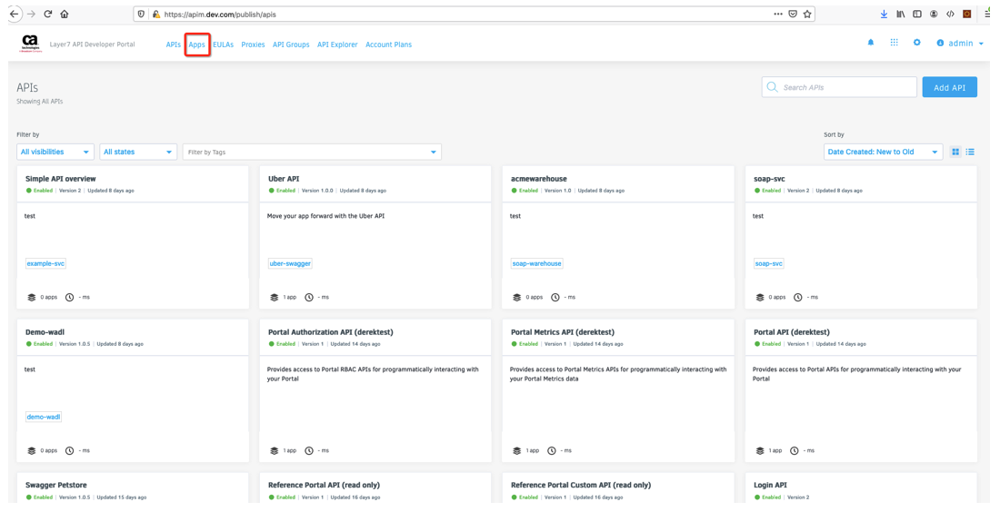

5. Click Add application

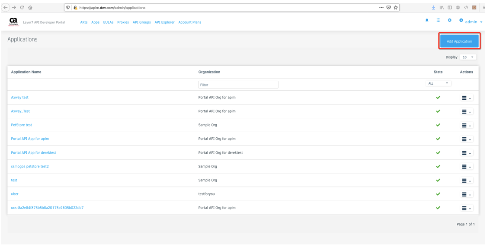

6. Add the details to the client application. Click Next.
    1. Selected Organization – Select the Portal API Org for "APIM" from the drop-down list.  
    2. Application Name – Choose a name 
    3. Public Description – Choose a description


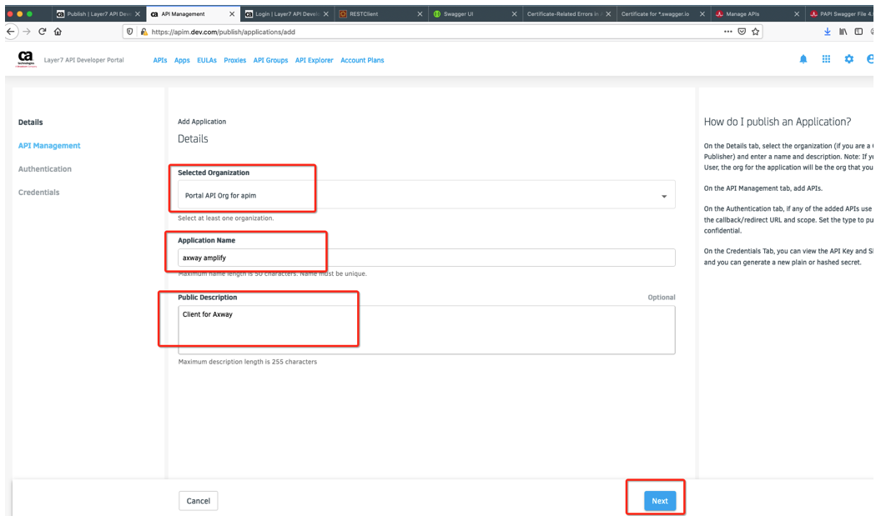

7. Select the APIs to work with for this client. Accept EULA. Click Next.
    1. Login API
    2. Portal API (apim)
    3. Portal Authorization API (apim)

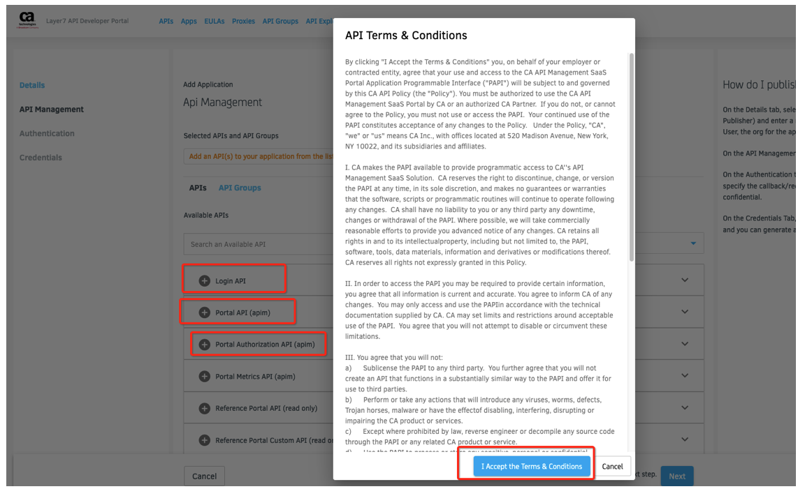

8. For authentication, click Confidential.

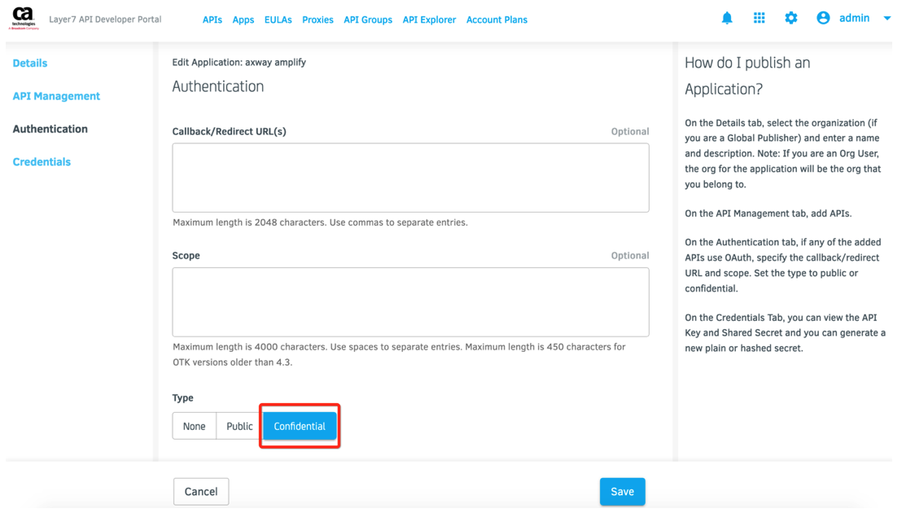

9. Click Create.

10. The Credentials appear and you can copy these 2 values for the application. Select Done.

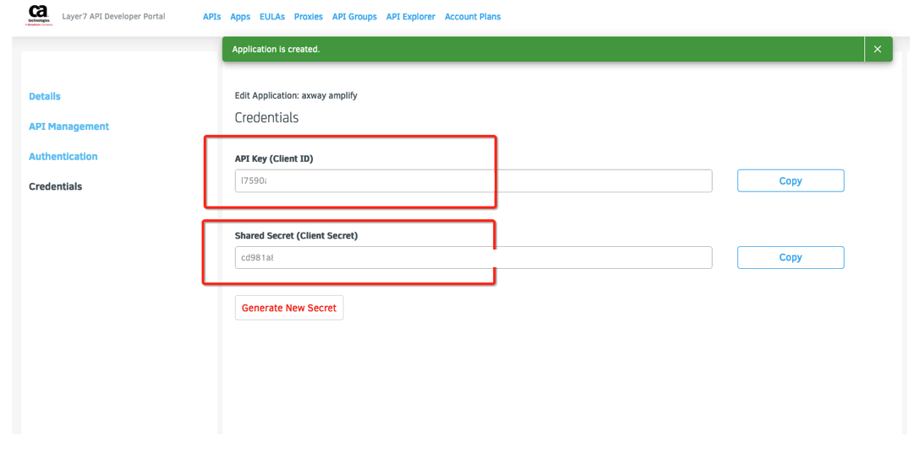

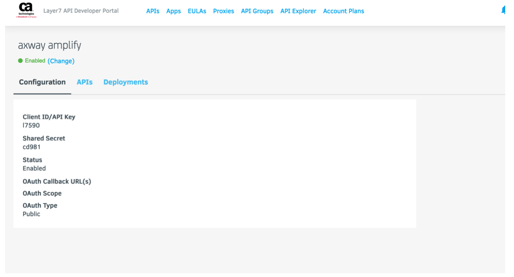

## Access tokens


To test the application, you will first need to gain access to a token using the client credentials OAuth flow.  The Client ID and Secret from above will be used to create an access token, to be used for every subsequent call.  

```
curl -k -X POST https://<your domain>:9443/auth/oauth/v2/token --data 'client_id=<your client id>&grant_type=client_credentials&scope=OOB&client_secret=<your client secret>'
```

You can then use this token with in an Authrorization Header. Example fetching APIs:

```
curl -X GET -H 'Authorization: Bearer <your token>' https://<your domain>:9443/apim/api-management/1.0/apis
```

## Tenant Gateway

You should create a new application for accessing all meta data around the tenant Portal.  This will be the same process as the admin portal with different options. 

**API Management**

1. Select Portal API for "TenantID"
2. Choose a different Application Name

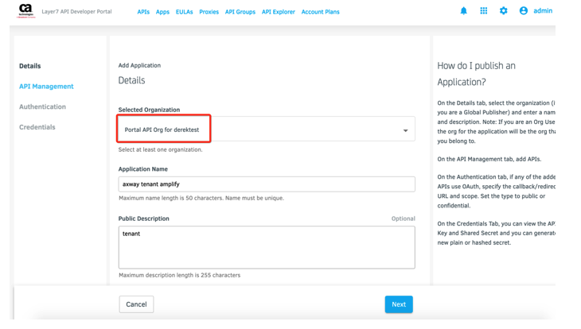

3. Select all of the Tenant ID API Portal API's as the API's for the application

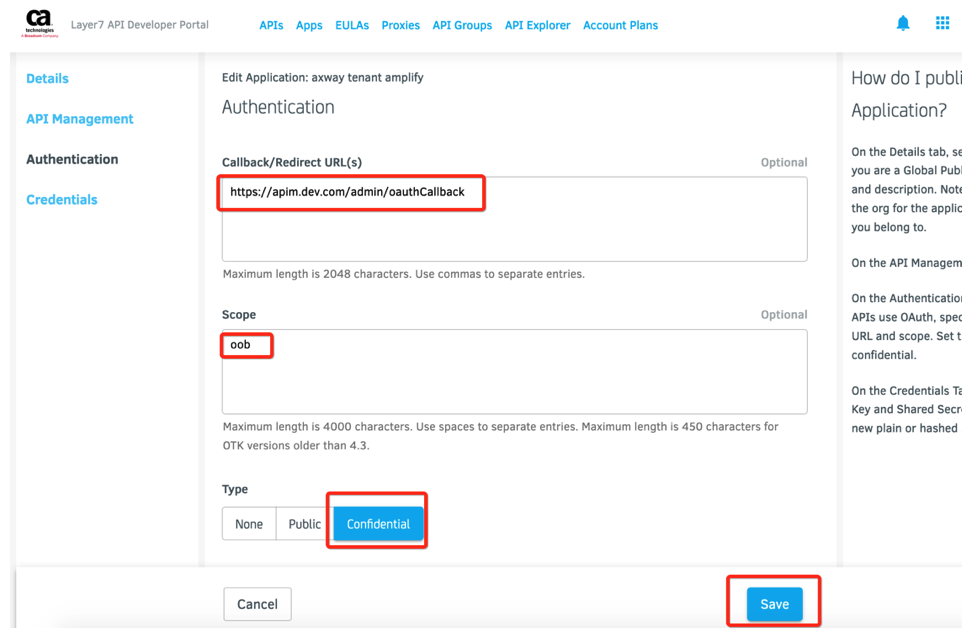

**Authentication**

1. Choose a callback URI. Example:
    1. ```https://<your domain>/admin/oauthCallback```
2. Choose scope as ```oob```
3. Click Confidential and click create.


4. Click Done.

****

## Using an API Key for an API that resides on a tenanted Gateway

First, you will need to gain access to an API key and figure out the URL as well as any meta data surrounding the API.  So, you will need to call the tenant ID API to gain access to all applications.  


You can use an application uuid and fetch the API entry.

Example: Fetch Applications

```
GET https://<your domain>:9443/<your tenantid>/Applications
{
	...
	"uuid": "f786e088-8fcd-4a3e-9c4a-b4e8aa473f01",
	"name": "Swagger Petstore"
	...
}
```

Example: Fetch API entry via the UUID
```
GET https://<your domain>:9443/apim/api-management/1.0/apis/<app uuid>
{
	"uuid": "f786e088-8fcd-4a3e-9c4a-b4e8aa473f01",
	"name": "Swagger Petstore",
	"ssgUrl": "petstore"
}
```

The api response shows the ssgUrl (gateway uri), copy this out of the response and place this in your client browser URL. You will most likely know the gateway’s URL after your discovery call, but you would need to know that in order to call the exposed end point (Gateway URL path).

When you call the gateway’s exposed endpoint you will need to gain access to the api key from response above in order to place this into the apikey parameter:

Example gateway call with ssgUrl:

```
GET https://<your host>/petstore/store/inventory?apikey=<your key>
{
    "sold": 190,
    "string": 247,
    "healthy": 6,
    "pending": 211,
    "available": 317,
    "avalible": 1
}

```